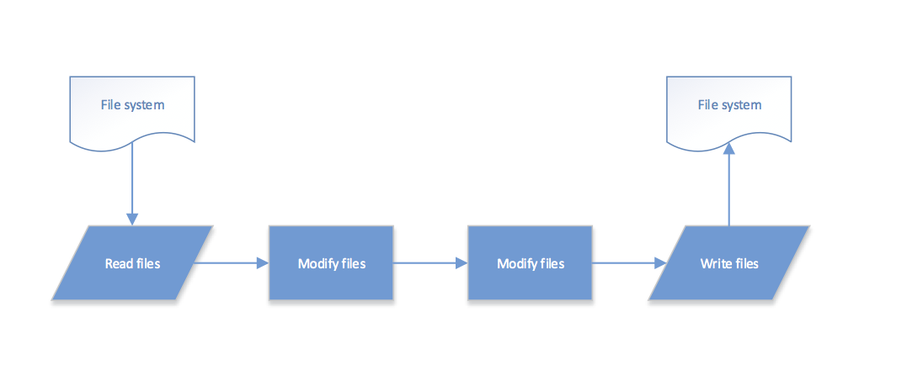

# Topology Website Implementation

## 1. Structure

We are using MVC(Model-View-Controller) Mode.

- Model:
	- Implementation: MongoDB
	
- View:
	- Implementation: Jade
	
- Controller
	- Implementation: Express
	

## 2. Dependencies(package.json)

```
{
  "name": "Topology",
  "version": "0.0.1",
  "private": true,
  "scripts": {
    "start": "node ./bin/www"
  },
  "dependencies": {
    "express": "~4.2.0",
    "static-favicon": "~1.0.0",
    "morgan": "~1.0.0",
    "cookie-parser": "~1.0.1",
    "body-parser": "~1.0.0",
    "debug": "~0.7.4",
    "jade": "~1.3.0",
    "less-middleware": "1.0.x",
    "mongodb": "1.4.8",
    "connect-mongo": "0.4.1"
  }
}
```

## 3. Build System

### Gulp

